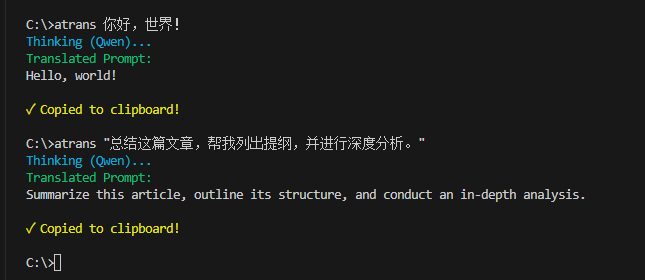

# Free LLM Translator

[中文简体](./README.md)

A CLI translation tool powered by large language models, supporting [Qwen (DashScope)](https://bailian.console.aliyun.com/) and **[Baidu Translate API](https://fanyi-api.baidu.com/product/13) (1 million characters free per month)**.

Designed for developers, it enables rapid translation directly from the terminal, with results automatically copied to your clipboard to streamline your workflow.

## ✨ Features

- **Multi-Model Support**: Integrated with Qwen-Plus (default) and Baidu Translate API.
- **Lightning Fast**: Streaming output delivers translations instantly without waiting.
- **Workflow Friendly**: Results are automatically copied to the clipboard, ready to use.
- **Cross-Platform**: Includes `.bat` (Windows CMD) and `.ps1` (PowerShell) launch scripts.
- **Colorized Output**: Clear visual distinction between the reasoning process and the final translation.



## 📦 Installation & Setup

1. **Clone the Repository**
   ```bash
   git clone https://github.com/iChenwin/FreeLLMTranslator.git
   cd FreeLLMTranslator
   ```

2. **Install Dependencies**
   ```bash
   pip install -r requirements.txt
   ```

3. **Configure API Keys**
   Create or edit `config.json` in the project root:
   ```json
   {
       "current_provider": "baidu",
       "providers": {
           "qwen": {
               "api_key": "sk-your-qwen-api-key",
               "base_url": "https://dashscope.aliyuncs.com/compatible-mode/v1",
               "model": "qwen-plus"
           },
           "baidu": {
               "appid": "your-baidu-appid",
               "api_key": "your-baidu-secret-key",
               "model_type": "llm"
           }
       }
   }
   ```

## 🚀 Usage

### Basic Usage
Run the script directly in your terminal followed by the text you want to translate:

**Windows (CMD/PowerShell)**
```bash
# Translate a simple phrase
atrans Hello World

# Translate a long sentence (use quotes)
atrans "Summarize this article, help me create an outline, and conduct an in-depth analysis."
```

### Quick Access (Recommended)
Add the project directory to your system's `PATH` environment variable to use the `atrans` command from anywhere.

## 🛠️ Advanced Options

### Switch Translation Provider
Modify the `current_provider` field in `config.json` to switch providers:
- `"qwen"`: Use Qwen (Recommended for better semantic understanding)
- `"baidu"`: Use Baidu Translate
